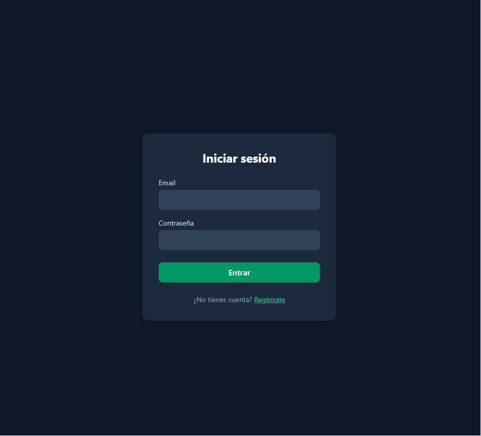
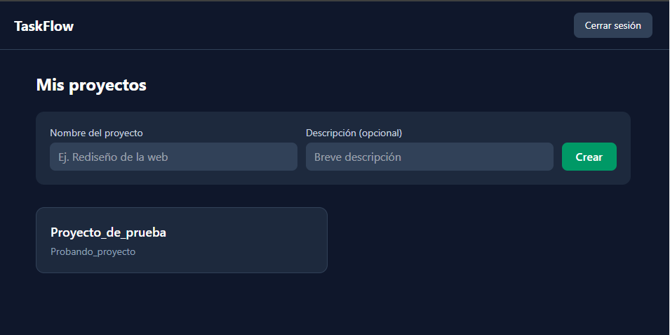
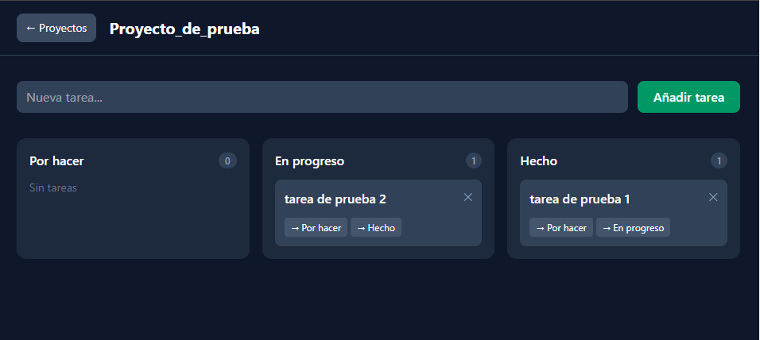
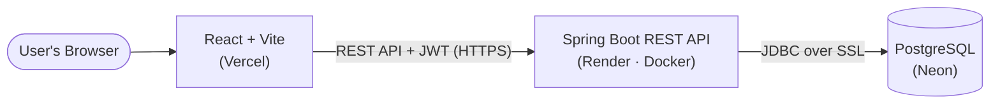

# TaskFlow

A full-stack Kanban project management application, built from scratch with a **Spring Boot REST API**, **JWT authentication**, and a **React + TypeScript** frontend. Deployed end-to-end on a modern, containerized cloud stack.

### 🚀 [Live Demo](https://taskflow-ten-silk.vercel.app)

> ⚠️ **Note:** The backend is hosted on Render's free tier, which spins down after a period of inactivity. The **first request may take ~50 seconds** while the server wakes up. Subsequent requests are fast.


---

## 📸 Screenshots

> _Add your screenshots to a `docs/` folder in the repo and they'll show up here._

| Login | Projects | Kanban board |
|-------|----------|--------------|
|  |  |  |

---

## ✨ Features

- 🔐 **Secure authentication** — register and log in with JSON Web Tokens (JWT) and BCrypt-hashed passwords.
- 📋 **Project management** — create and browse your own projects.
- 🗂️ **Kanban board** — a three-column board (To Do / In Progress / Done) for each project.
- ✅ **Task management** — create tasks, move them between columns, and delete them, with the UI updating instantly.
- 🔒 **Per-user data isolation** — every endpoint enforces ownership checks, so users can only ever access their own projects and tasks (protection against IDOR).
- 📱 **Responsive UI** — built with Tailwind CSS.

---

## 🛠️ Tech Stack

**Backend**
- Java 25, Spring Boot 4
- Spring Security 7 (stateless JWT authentication)
- JWT via `jjwt`, BCrypt password hashing
- PostgreSQL with Hibernate / Spring Data JPA
- Maven, Docker (multi-stage build)

**Frontend**
- React + TypeScript
- Vite
- Tailwind CSS
- React Router
- Axios

**Infrastructure**
- **Neon** — managed PostgreSQL database
- **Render** — containerized backend (Docker)
- **Vercel** — frontend hosting

---

## 🏗️ Architecture



The frontend is a static single-page application served from Vercel's CDN. It communicates with the Spring Boot API over HTTPS, sending a JWT in the `Authorization` header on each authenticated request. The API persists data in a PostgreSQL database hosted on Neon, connected over an encrypted (SSL) connection.

---

## 🔎 Technical Highlights

These are some of the engineering decisions behind the project:

- **Stateless JWT authentication.** A custom `OncePerRequestFilter` validates the token on every request; no server-side sessions are stored, which keeps the API horizontally scalable.
- **Ownership-based authorization (anti-IDOR).** Repository queries are scoped by owner (e.g. `findByIdAndOwner`), so a user can never read or modify another user's data by guessing IDs.
- **Multi-stage Docker build.** A JDK stage compiles the JAR; a slim JRE stage runs it. The final image contains only the runtime and the application, making it smaller and reducing its attack surface.
- **Externalized configuration (12-factor).** Database credentials, the JWT secret, and CORS origins are all injected via environment variables, so the same build runs in local and production environments without code changes.
- **Layered architecture.** Clear separation of concerns: Controller → Service → Repository, with DTOs isolating the API contract from the persistence entities.

---

## 💻 Running Locally

### Prerequisites
- Java 25
- Node.js 20+
- Docker (for the local PostgreSQL database)

### 1. Clone the repository
```bash
git clone https://github.com/josemanueldg02-star/taskflow.git
cd taskflow
```

### 2. Start the database
```bash
docker compose up -d
```

### 3. Configure and run the backend
Create a `.env` file in the project root (see `.env.example`) with:
```
POSTGRES_DB=taskflow
POSTGRES_USER=taskflow
POSTGRES_PASSWORD=your_local_password
JWT_SECRET=a_base64_secret_at_least_256_bits_long
JWT_EXPIRATION=86400000
```
Then run the Spring Boot application (it starts on `http://localhost:8080`).

### 4. Run the frontend
```bash
cd frontend
npm install
```
Create `frontend/.env` (see `frontend/.env.example`) with:
```
VITE_API_URL=http://localhost:8080
```
Then start the dev server:
```bash
npm run dev
```
The app will be available at `http://localhost:5174`.

---

## ⚙️ Environment Variables

| Variable | Where | Description |
|---|---|---|
| `POSTGRES_DB` / `POSTGRES_USER` / `POSTGRES_PASSWORD` | Backend | Local database credentials |
| `SPRING_DATASOURCE_URL` / `SPRING_DATASOURCE_USERNAME` / `SPRING_DATASOURCE_PASSWORD` | Backend (prod) | Production database connection (Neon) |
| `JWT_SECRET` | Backend | Secret key for signing JWTs (must be ≥ 256 bits) |
| `JWT_EXPIRATION` | Backend | Token lifetime in milliseconds |
| `CORS_ALLOWED_ORIGINS` | Backend | Allowed frontend origin(s) |
| `VITE_API_URL` | Frontend | Base URL of the backend API |

---

## 🗺️ Roadmap

- [ ] Drag-and-drop for moving tasks between columns
- [ ] Editing tasks and adding due dates
- [ ] Automated tests (JUnit + integration) and CI/CD with GitHub Actions

---

## 👤 Author

**José Manuel Domínguez García**
- GitHub: [@josemanueldg02-star](https://github.com/josemanueldg02-star)
